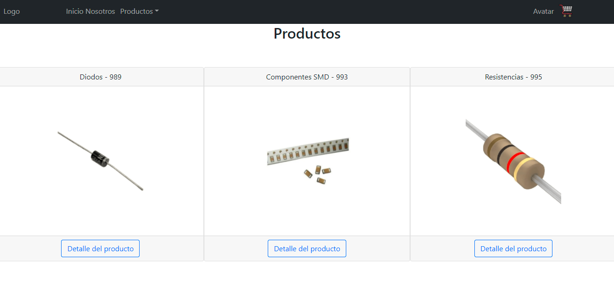
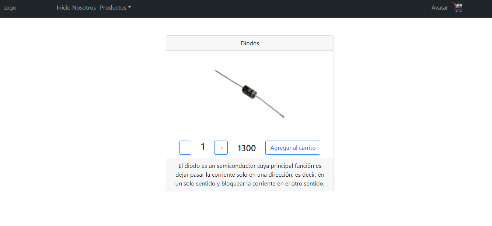
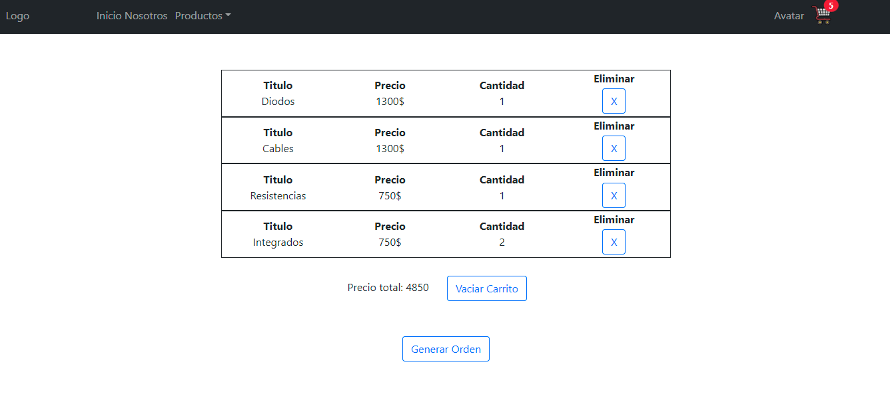

# Ecommerce  🚀

Electronics es una tienda ecommerce que distribuye componentes electrónicos a toda la Argentina. 
Es el nexo entre los fabricantes ubicados en el exterior y los clientes. Se pueden registrar en el sitio para investigar los beneficios y ofertas.


## Construido con 🛠️

* [HTML](https://www.w3.org/) - Lenguaje de etiquetas
* [CSS](https://www.w3.org/) - Hojas de estilos
* [JS](https://www.w3.org/) - Lenguaje de programación
* [NODE](https://nodejs.org/es/) - Entorno de ejecución
* [BOOTSTRAP](https://getbootstrap.com/) - Framework CSS
* [REACT](https://es.reactjs.org/) - Libreria de JavaScript
* [GIT](https://git-scm.com/) - Sistema de control de versiones
* [GITHUB](https://github.com/) - Repositorio online
* [NETLIFLY](https://www.netlify.com/) - Hosting
* [FIREBASE](https://firebase.google.com/) - Hosting


## Script 📋

Ejecuta la aplicación en el modo de desarrollo.
Abre http://localhost:3000 para verla en el navegador.

```
npm start
```

Crea la carpeta build en donde construira la aplicacion para produccion y optimiza la compilación para obtener el mejor rendimiento.

```
npm run build
```


## Preview 👁️‍🗨️






## Demo 💻

Para visualizar la demo del proyecto se podrá acceder con el siguiente [link](https://ecommerce-electronic.netlify.app)


## Autores ✒️

- [@RuizYamil](https://www.github.com/RuizYamil)